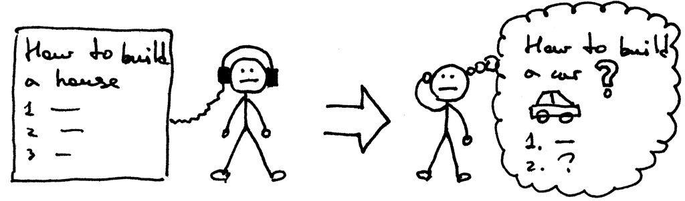

现代的软件系统建立在一些基础的组件上面，比如操作系统、编译器、数据库、web server 和 web 框架等，在此基础上，才有了更高层的库以及我们平时所使用的网站和 APP 等。完整地实现它们是十分困难的，需要大量的专业知识、dirty work 和团队的协作，所以很多人将其视为“黑箱”，会调包即可。然而，在通向优秀 progammer 的路上，了解它们基本的运作原理是有必要的，这可以拓展我们知识的广度，学习到优秀的设计思想，探索它们的过程也会如走迷宫一般，在抵达出口的时候，所收获的成就感也是巨大的。

在接下来的一些天内，我们会从零开始实现一些基本的组件。这里说的“零“指的是我们不会使用除了编程语言及其标准库之外的东西。

- [x] [Web 框架，与 Flask 有相似的 API](#)

- [x] [Web server，实现了 WSGI 协议 ](#)

- [x] [Template engine，模板渲染引擎](#)

- [x] [Object mapper，用 type hints 来定义 MongoDB 模型，并提供简洁的读写 API](#)

- [x] [操作系统TM，基于协程实现，支持多任务](#)

- [ ] JavaScript 框架，数据驱动视图，与 React 有相似的 API

- [ ] 富文本编辑器，基于**受控**的 contenteditable 来实现

- [ ] 简单的解释器，使用 Lisp 语法风格

- [ ] 极简的深度学习框架，实现了自动求导

- [ ] More...

代码将尽量被控制在500行以内，为了实现的简洁，错误检查、运行效率和复杂的特性等一般都会被忽略掉，当然这些在严肃的框架中是至关重要的。

本系列的内容将会不断更新，相关的代码在 [我的 github](https://github.com/cymoo) 上可以找到，如果对实现有疑问，可在对应的代码仓下创建 issue。

让我们开始这一段旅程吧。

> 我听过，然后我忘却

> 我看过，然后我记得

> 我动手，然后我理解

=======
参考

1. 文中的漫画来源于 <https://ruslanspivak.com/lsbaws-part1/>