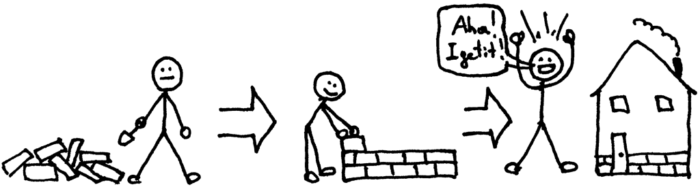

现代的软件系统建立在一些基础的组件上面，比如操作系统、编译器、数据库、web server、web 框架等，在此之上，才有了我们日常使用的林林总总的网站与APP。完整地实现这些组件是十分十分困难的，需要大量的理论知识与dirty work，因此很多人将其视为“黑箱”。然而，在通向优秀progammer的路上，了解它们基本的运作原理是有必要的，这可以拓展我们知识的广度，学习到优秀的设计思想，探索它们的过程也会如走迷宫一般，在抵达出口的时候，所收获的成就感也是巨大的。

在接下来的一些天内，我们会从零开始实现一些基本的组件，这里说的“零“指的是我们不会使用除了编程语言及其标准库之外的任何东西。

* [Python web 框架，与 Flask 有相似的 API](./)
* [Python web server，实现 WSGI 协议 ](./)
* [Template engine](./)
* [Object Mapper，方便地操作MongoDB](./)
* [JavaScript 框架，与 React 有类似的 API](./)
* [富文本编辑器](./)
* [一个玩具解释器](./)
* [深度学习框架，与 Pytorch有类似的 API](./)

我们会尽量将代码控制在500行左右，为了简洁考虑，我们会忽略掉错误检查，也不会考虑代码的运行效率等（当然这些在严肃的框架中是至关重要的）。

让我们开始这一段旅程吧。

> 我听过，然后我忘记

> 我看过，然后我记得

> 我动手，然后我理解

