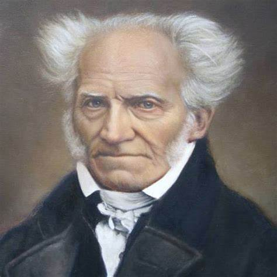

>  人类从我学到为数不多的事，却永难忘怀。

1860年叔本华去世了，他的坟墓上放着一块沉重的花岗石，遗嘱要求墓碑上只刻上他的名字，亚瑟.叔本华，“不要加上其他东西，没有日期，没有年份，没有只字片语”。躺在那个平凡墓碑下的人希望他的作品能为自己说话。

## 叔本华

1788年，叔本华生于但泽。

叔本华不会与人建立亲密关系，甚至包括他的母亲，在26岁时，母亲将他永远逐出家门，不再相见。他把周围的人比做一团火，“谨慎的人取暖时仍需保持一定距离”，即使与他人共处时，他也决心选择孤独，以免丧失自己的完整性。他这样写到：“六分之五的人类只配受到轻蔑，上天用多余的造化赋予我内心怀疑、敏感、激情和骄傲，从而使它陷入孤立”。他脾气火爆，常常被人看到顶着疯狂的发型，穿着过时的衣服，坐在路边的长椅上，对着陪伴自己的小狗，痛骂人性的丑恶，结果被人嘲笑患有精神病。他因厌烦邻居发出的噪音，而与隔壁的女裁缝发生争执，并将她推下楼，导致对方的手臂终生伤残，最终他被法院判决每年支付邻居一笔费用；20年后，女裁缝去世了，叔本华在日记中写下：“老妇逝，重负释”。但是晚年的《附录与补遗》一书，却采取了全新的语气，他认为透过每一个人的痛苦，我们得以彼此相连：

> 人与人之间最适当的称呼不是某某先生，而应该是与我一同受苦的人。不论这种称呼听起来多么奇怪，却是根据事实把别人放在最正确的位置，并提醒我们最必要的事就是宽容、耐心、饶恕，并爱我们的邻人，这是每一个人都需要的事，也是每一个人要为别人付出的事。

甚至书中的一些话，足以作为现代心理治疗教科书的引言：

> 我们应该宽厚地对待每一个人的愚蠢、缺点和恶行，牢牢记住我们所有的也只有自己的愚蠢、缺点和恶行。因为它们只是人类必然的缺点，我们自己也是人，所以内心深处也都埋藏着完全相同的缺点。我们不应该只因为别人在此刻与我们不同，就对他们的恶行感到愤慨。

叔本华最看不起的就是名声，但他却如此地渴望名声。在他三十岁那年完成《作为意志和表象的世界》后，整个学界置若罔闻，然而他仍然坚信：“一代人欣喜若狂地赞同我写的每一行字的那个时代必将到来。”

书在出版多年后也没有卖出几本，但他始终无法放弃对名声的渴望。他的著作中弥漫着没有得到成功的痛苦，他定期搜寻报纸和杂志，希望找到任何关于他或他的著作的报道。每次外出旅行，他都会指派他的朋友负责搜寻的任务。虽然不断取消自己被忽视的现象，但他最终还是放弃自己在有生之年名扬四海的念头，在后来的书的引言中他公开谈到未来的世代将会发现他：“不是为了同时代的人们、不是为了同祖国的人们，而是为了人类，我才 献出今日终于完成的这本书。我在这样的信心中交出它，相信它不会对于人类没有价值，即令这种价值，如同任何一种美好的事物常有的命运一样，要迟迟才被发觉。因为，只是为了人类，而不可能是为了这转瞬即逝的当代， 这个唯个人眼前妄念是务的世代，我这脑袋在几乎是违反自己意愿的情况 下，通过漫长的一生，才不断以此工作为已任。在这期间，即令未获人们的同情，也并不能使我对于这一工作的价值失去信心。”

叔本华去世十年之前便留下详细的遗嘱，尸体要在停尸间存放五天以上，直至腐烂才能下葬，这或许是他最后表达厌世的态度。他的葬礼在一个密不透风、充满恶臭的停尸间举行，多位参加葬礼的人由于无法忍受而在致哀仪式的中途离开。致辞的牧师的开场白是：这个人一生住在我们之间，然而他一直是我们中间的陌生人，很少表现自己的感受。站在这里的人，没有一个人是他的血亲；他孤独生活，孤独死去。

晚年他在一本书的末尾留下一个小诗：

> 我如今疲惫不堪地站在路的尽头
>
> 憔悴的额头几乎连桂冠都难以承载
>
> 可我对此生的成就感到欣喜
>
> 从不因他人言论而畏缩。

## 表象与意志

整个的世界是一个意志，意志就是真正的自在之物，“每人自己就是这全世界，就是小宇宙，并看到这世界的两方面都完备无遗地皆备于我。世界和人自己一样，彻头彻尾是意志，有彻头彻尾是表象，此外再没有剩下什么东西了。

## 自我

如果我们回想已经过去的几十个世纪，回想在那些时间中生活过的亿万的人们，为什么恰好是我，有着这样的幸运占有这宝贵的、飘忽的和唯一实在的现在呢？当那几百代的人们，那些世代所有的英雄们都在这过去的黑夜里湮沉，化为乌有的时候，可是我，那么渺小的我为什么又实际地还存在着呢？或者可以更简短地说，为什么这个现在，我的现在，却恰好现在还在着，而不是也早就过去了呢？

世界通过当时当下的我来体现自身。当我不再存在后，同样的，世界会通过同物种的其他个体以同样的方式来呈现自我。这些个体将会发现自己是意识的主体，把自己称做“我”，追求其目标，经历苦难与满足，然后又不再存在。我可以这么认为：现实自体不会关心是这个还是那个个体的意志呈现。自然本身不会因为任何一个具体部分的毁灭而悲伤，没有我它仍然会存在。如果我与表象世界的其他个体共享同样的“内在本质”，那么不管表象消逝与否，我的本质内核是继续存在的。其实，“继续存在”是对叔本华观点的一种曲解。从时间无限的意义上讲，现实自体是永恒的。我拥有我的“现在”，其他的每个“我”，不管是存在过的还是即将存在的，都同样拥有它的时间，对它而言同样是“现在”。从现实自体的角度看，时间是一个幻觉。

## 不可消除的苦难

“意志从无意识的夜晚醒来，发现自己这个个体置身于一个无边无际的世界，周围还存在无数其他个体，全都在奋斗、受苦、犯错误。仿佛是做了一场恶梦，它匆匆地返回到原来的无意识状态。然而在此之前它的欲望还数不胜数，要求也无穷无尽，每个欲望一旦满足，新的欲望又产生了。世间没有哪种满足感足以平息意志的渴望，可以为意志的需要设定一个终极目标，可以填满意志内心的无底洞。在这一点上，让我们思考一个问题：人在获得任何一种满足的时候通常会出现什么？常常不过是维持本身的存在而已。要生存就必须每天不懈地努力，不断地操心，与苦难和需要作斗争，而人终有一死。生活中的一切都表明，尘世的幸福注定会受到挫败，或者被认为是一种幻觉。这样说，其根据可以到事物本质的深处去寻找。”

## 死亡

死亡，它是存在的内在悲剧，我们的存在终将结束，我们对此应该采取什么样的态度呢？

> 情愿死，欣然死，怡然死，是安于现状者的特权，他们放弃并且否定了生命意志……他们自愿放弃了我们所知的存在，转而得到我们所认为的虚无。因为相对于那种存在，我们的存在是虚无。佛教教义把那种存在叫做“涅槃”，也就是毁灭。

叔本华面对死亡的态度就像他面对一生的每一件事：极度清明。他面对死亡时，毫不退缩，从来不曾屈服于超自然信仰的软化剂，坚持用理性面对人生的终点。他说，透过理性可言首度认识死亡，观察别人的死亡可以类推自己必然面临死亡，可以不言而喻地推断死亡是意识的停止，是自我无法挽回的湮灭。

他说面对死亡有两种方式：理性的方式、错觉和宗教的方式，后者希望有持续不灭的意识和舒适的死后生命。所以，死亡的事实和恐惧是深刻思考的先驱，也是哲学和宗教之母。

绝大多数人的一生也只是一个为着这生存本身的不断的斗争，并且明知最 还是要在这斗争中失败。使他们经得起这一艰苦斗争的，虽也是贪生，却更是怕死；可是死总是站在后台，无可避免，并且是随时可走到前台来的。生命本身就是满布暗礁和漩涡的海洋。人是最小心翼翼地，千方百计避开 这些暗礁和漩涡，尽管他知道自己即令历尽艰苦，使出“全身解数”而成功地绕过去了，他也正是由此一步一步接近那最后的、整个的、不可避免不可挽救的船沉海底，并且是直对着这结果驶去，对着死亡驶去。这就是艰苦航行最后目的地，对他来说，这目的地比他回避过的所有暗礁还要凶险。

>  每一口呼吸，都使我们暂时逃离不断冲击我们的死亡。但最后获胜的，必然是死亡，因为从出生以来，死亡就是我们的命运，它只是在吞噬猎物之前玩弄一番。可是，我们却一直对生命抱持有大量的兴趣和妄念，就好像竭尽所能地吹肥皂泡，希望越大越好，越久越好，但肥皂泡却注定爆裂，化为乌有。

一生不过是当下的片刻，总是升起又消失。而现在已经结束了。

> 生命的开始和结束是多么的不同啊！前者沉醉在欲望的狂热和感官乐趣的狂喜，后者则是所有器官的毁坏和尸体的腐败臭味。从生到死的路上，人生的幸福和喜悦总是每况愈下：乐而忘忧的童年，轻松愉快的青春期，辛苦劳累的成人期，脆弱可怜的老年期，饱受病痛的晚年期，以及最终的痛苦死亡。人生岂不就是踏出错误的一步，然后越来越明显地呈现其结果吗？

他如何描述死亡呢？我们是牧场上蹦蹦跳跳的绵羊，死亡则是任意从我们之中选出一只来宰杀的屠夫；我们就像戏院里的小孩，热切等待节目开始，幸运地不知道什么事会发生在我们身上；我们是精力充沛的水手，在航行中避开岩石和旋涡，却毫不偏差的航向最终的悲惨海滩。

他总是把生命周期描绘成无法改变的绝望航行。

叔本华还有一种避开死亡焦虑的方法：当自我实现达到极致时，死亡焦虑就减轻到最低，“实现自己一生”的充实感可以减轻死亡焦虑。

叔本华自己呢？他的人生是否正确而又意义呢？他完成了自己的使命吗？毫无疑问他做到了这一点：

> 我向来希望能轻松赴死，因为任何寂寞度过一生的人，将比别人更能评断这种孤独的志业。我没有落入各种愚蠢可笑的事情之中，这些事只适合无能的两足人类，我的结局是快乐地知道自己要重返源头...并已完成我的使命。

从年轻人的立场看，人生有无止尽的长远未来；从老年人的立场来看，人生只是十分短暂的过去。当我们启程时，岸上的物体会越来越小，越来越难以辨识；往日的一切均是如此。

## 审美

叔本华是一位真正的无神论者，他从根本上质疑人类存在的价值。存在对他来说是一种漫无目的、痛苦的抗争，被一种我们无法控制的无意识的力量所驱使。要从这种存在中解脱出来，必须通过审美经验、悲天悯人和自我否定来舍弃我们的个体性。

## 宗教

就其对基督宗教的思想看：一方面基督教经典带着其荒谬、无稽、毫无意义的神话故事出现在世界，千百年来被滥用、扭曲；另一方面，叔本华对于基督献身十字架，自愿性地对作为表象存在的世界及自我的最终扬弃，从而实现了对作为意志的最终回归这一历程的完全肯定与赞扬。

## 影响

...

