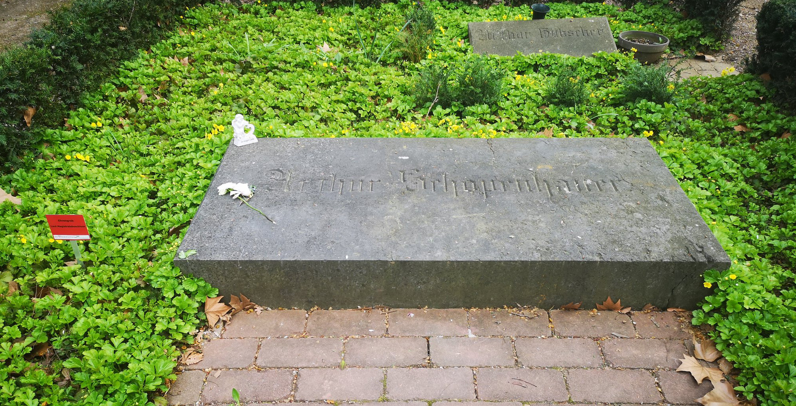

>  人类从我学到为数不多的事，却永难忘怀。

叔本华的坟墓上放着一块沉重的花岗石，遗嘱要求墓碑上只刻上他的名字，亚瑟.叔本华，“不要加上其他东西，没有日期，没有年份，没有只字片语”。躺在那个平凡墓碑下的人希望他的作品能为自己说话。

叔本华面对死亡的态度就像他面对一生的每一件事：极度清明。他面对死亡时，毫不退缩，从来不曾屈服于超自然信仰的软化剂，坚持用理性面对人生的终点。他说，透过理性可言首度认识死亡，观察别人的死亡可以类推自己必然面临死亡，可以不言而喻地推断死亡是意识的停止，是自我无法挽回的湮灭。

他说面对死亡有两种方式：理性的方式、错觉和宗教的方式，后者希望有持续不灭的意识和舒适的死后生命。所以，死亡的事实和恐惧是深刻思考的先驱，也是哲学和宗教之母。

>  身体的生命只是不断避免死亡、拖延死亡...我们吸入的每一口气都用来避开随侍在侧的死亡，因此，我们每一秒钟都在与死亡搏斗。

一生不过是当下的片刻，总是升起又消失。而现在已经结束了。

> 生命的开始和结束是多么的不同啊！前者沉醉在欲望的狂热和感官乐趣的狂喜，后者则是所有器官的毁坏和尸体的腐败臭味。从生到死的路上，人生的幸福和喜悦总是每况愈下：乐而忘忧的童年，轻松愉快的青春期，辛苦劳累的成人期，脆弱可怜的老年期，饱受病痛的晚年期，以及最终的痛苦死亡。人生岂不就是踏出错误的一步，然后越来越明显地呈现其结果吗？

他如何描述死亡呢？我们是牧场上蹦蹦跳跳的绵羊，死亡则是任意从我们之中选出一只来宰杀的屠夫；我们就像戏院里的小孩，热切等待节目开始，幸运地不知道什么事会发生在我们身上；我们是精力充沛的水手，在航行中避开岩石和旋涡，却毫不偏差的航向最终的悲惨海滩。

他总是把生命周期描绘成无法改变的绝望航行。

叔本华还有一种避开死亡焦虑的方法：当自我实现达到极致时，死亡焦虑就减轻到最低，“实现自己一生”的充实感可以减轻死亡焦虑。

叔本华自己呢？他的人生是否正确而又意义呢？他完成了自己的使命吗？毫无疑问他做到了这一点：

> 我向来希望能轻松赴死，因为任何寂寞度过一生的人，将比别人更能评断这种孤独的志业。我没有落入各种愚蠢可笑的事情之中，这些事只适合无能的两足人类，我的结局是快乐地知道自己要重返源头...并已完成我的使命。

在最后一本书的最后几行他写到：

> 我现在疲倦地站在道路的终点
>
> 疲惫不堪的面容几乎难以承受桂冠
>
> 但我高兴地看到自己所做的事情
>
> 始终不因别人的话而动摇

从年轻人的立场看，人生有无止尽的长远未来；从老年人的立场来看，人生只是十分短暂的过去。当我们启程时，岸上的物体会越来越小，越来越难以辨识；往日的一切均是如此。

