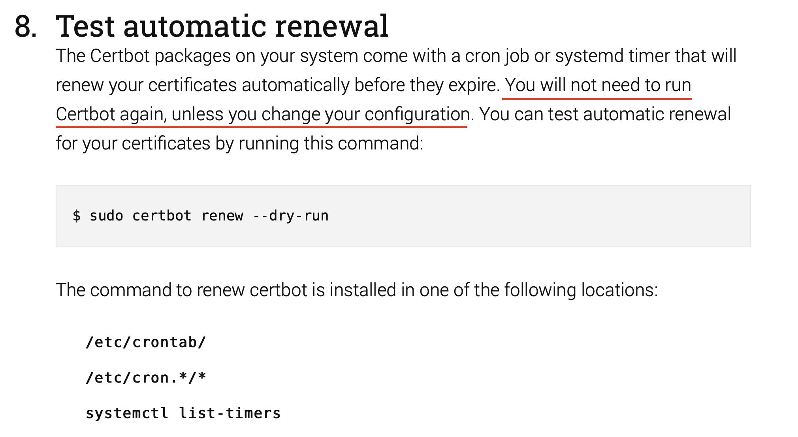

# Certbot instruction

Refer to: <https://certbot.eff.org/instructions>, <https://ksmx.me/letsencrypt-ssl-https/>

1. Install certbot

   ```bash
   apt install certbot
   ```

2. Run certbot

   ```bash
   certbot certonly --webroot -w /var/www/daydream.site/public -d daydream.site --email wakenee@hotmail.com
   ```

3. Generate dhparam (required by nginx):

   ```bash
   mkdir /etc/nginx/ssl
   openssl dhparam -out /etc/nginx/ssl/dhparam.pem 2048
   ```

4. See ssl configuration provided by Mozilla: <https://ssl-config.mozilla.org>

5. Renew cert periodicity (no need anymore?)
   To obtain a new or tweaked version of this certificate in the future, simply run certbot again.
   To non-interactively renew *all* of your certificates, run "certbot renew".

   ```bash
   crontab -e
   # input
   * * * */1 * /usr/bin/certbot renew 1>> /dev/null 2>&1
   ```
   
  
